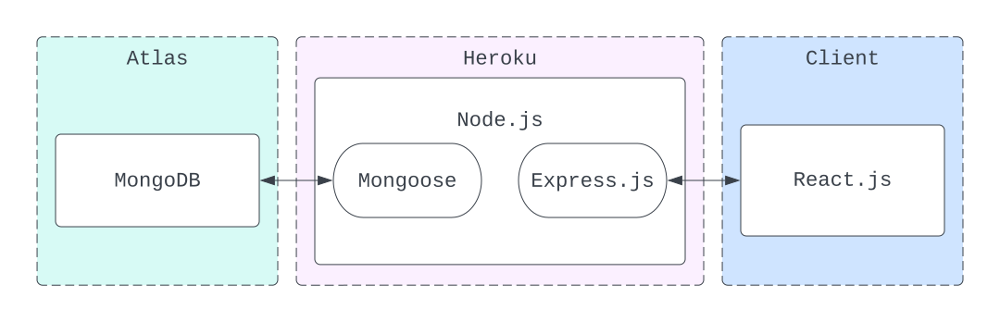

# Modern To-Do App


This project uses the MERN technology stack to create a simple CRUD task management web-app.

_MERN: MongoDB, Express.js, React.js, Node.js_
# Architecture
An Express.js server acts as the back-end. The client requests for the React.js front-end page from Express.js server, then subsequently does API calls to the Express.js server to create, read, update and delete data from the database via HTTP requests. 

The Express.js server uses the Mongoose library to connect with the MongoDB database, allowing it to perform CRUD operations.



For my deployment, the MongoDB instance is hosted on MongoDB Atlas while the Express.js server runs on Heroku.

# Running for Deployment
To run the web application, we need to first define the environmental variables in a `.env` file, replacing the `DB_URL` with your own instance of MongoDB.
```bash
NODE_ENV = "staging"
DB_URL = "mongodb://localhost:27017/ToDoDB"
```
Following which, we can run a pre-defined script `npm run manual-build-all` that will install the required node packages, build the react project, then run the server. The default port is 5000 so we can visit the site at `localhost:5000`.
# Running for Development
You still define the environmental variables as described above before running for development.

## Requirements
The project runs on the MERN stack, thus we require the following programmes
- node.js
- mongodb

The specific node modules required are:

Within ```react-app```
- react
- react-helmet
- lodash
- semantic-ui-react
- semantic-ui-css

Within ```express_backend```
- express
- mongoose
- mongodb
- cors
- bodyParser
- path
- dotenv

> Warning: <br>
> With the current version of ```semantic-ui-css@2.4.1```, there exist a double `;;` within `react-app/node_modules/semantic-ui-css/semantic.min.css` that needs to be removed before it can important properly into the react project.

Note that you can install these using `npm install package.json` in the respective directories.

## The Front-End
From the ```react-app``` directory, 
- run ```npm start``` to begin the development server.
- run ```npm build``` to create an optimised production build that can be accessed by the server.
##  The Back-End
From the app's  root directory, run ```node server.js```

Note that you will need to build the front-end before being able to access it from the root of the server.

## Running Mongodb
From the app's root directory, run with
```mongod --dbpath=./mongodb_data```

Note that you need to make the directory ```./mongodb_data``` before starting the database.

### Manually Modifying the DB

__Note that this is not needed for running the software.__

We can connect to the DB using ```mongosh``` which will open a shell that automatically connects to the running ```mongod```.

We set up the database manually using the following commands:
```bash
use ToDoDB # Creates the new / change to exisiting DB
db.createCollection("user_tasks") # creates collection in the DB
db.user_tasks.insertMany([
    { name: 'Learn HTML', desc: "Create at least something", tags: ['Task 1.1', 'Task 1.2', "Brandon", "Hello", "hello"], taskStatus: "Not Started" },
    { name: 'Learn CSS', desc: "Create at least a stylesheet", tags: ['Task 2.1', 'Task 2.2'], taskStatus: "In Progress" },
    { name: 'Learn JAVASCRIPT', desc: "Create at least an APP", tags: ['Task 3.1', 'Task 3.2'], taskStatus: "Completed" },
    { name: 'Learn C++', desc: "Create at least a programme", tags: ['Task 3.1', 'Task 3.2'], taskStatus: "Completed" },
    { name: 'Learn Python', desc: "Create at least an AI", tags: ['Task 3.1', 'Task 3.2'], taskStatus: "Completed" },
    { name: 'Learn Haskell', desc: "Create at least a paper", tags: ['Task 3.1', 'Task 3.2'], taskStatus: "Completed" },
    { name: 'Learn C#', desc: "Create at least a game", tags: ['Task 3.1', 'Task 3.2'], taskStatus: "Completed" },
  ]) # insert the example data
```
### Play Around With the Data
```bash
db.user_tasks.updateOne(
  {name: "Learn C#"},
  { $set: { name: 'Learn C#', desc: "Create at least a game", tags: ['Task 3.1', 'Task 3.2'], taskStatus: "Not Started" }}
) # Updates document

db.user_tasks.insertOne({ name: "Learn MongoDB", desc: "Create at least a database", tags: ["database", "nosql"], taskStatus: "In Progress"}) # Insert a new document

db.user_tasks.deleteOne({name: "Learn MongoDB"}) # Delete document
```

### Other Useful ```mongosh``` Commands
- ```show dbs``` lists all the databases
- ```db.getCollectionNames()``` lists the collections in a database
- ```db.user_tasks.drop()``` drops the specific collection
- ```db.user_tasks.find()``` lists all objects in the collection
- ```db.user_tasks.deleteMany({})``` deletes all documents in the collection
